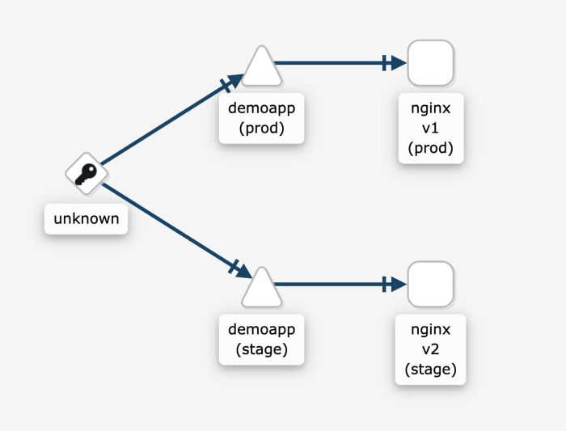

# Helm chart Book API - Demo de Blue/Green

Repositório de app para demonstração do Blue/Green

Inspirado no artigo do Medium em [Link](https://medium.com/infinite-lambda/canary-and-blue-green-deployments-with-helm-and-istio-4139886447b6).

<blockquote><i>obs: A imagem utilizada nesse exemplo está desatualizada.</i></blockquote>

### Foi criado uma imagem contendo uma API simples usando o Flask para essa demonstração
O tutorial seguido para criar a imagem foi a partir desse [Link](https://medium.com/nerd-for-tech/deploy-your-flask-rest-api-on-docker-909f5cfa8b0b) e encontra-se no Docker Hub com o nome de gabriellins/book-api. Veja o [link](https://hub.docker.com/repository/docker/gabriellins/book-api)

**Esse código contem os seguintes conteúdos**

- Aplicação de demo helm chart
- Configuração básica do Istio


**Pre-requisitos**
- EKS cluster running in AWS: https://docs.aws.amazon.com/eks/latest/userguide/create-cluster.html
- Kubectl installed: https://kubernetes.io/docs/tasks/tools/install-kubectl/
- Istio instalado no cluster: https://istio.io/docs/setup/install/istioctl/
- istioctl instalado: https://istio.io/docs/setup/getting-started/
- Helm3 instalado: https://helm.sh/docs/intro/install/

**Instalação**
```shell
$ kubectl create namespace prod
$ kubectl create namespace stage
$ kubectl label namespace prod istio-injection=enabled
$ kubectl label namespace stage istio-injection=enabled
$ helm install demoapiv1 helm-chart/demoapp/ --wait --set deployment.tag=v1 --namespace prod
$ helm install demoapiv2 helm-chart/demoapp/ --wait --set deployment.tag=v2 --namespace stage
$ kubectl create -f istio-config/gateway.yaml
$ kubectl create -f istio-config/vsvc.yaml
```


Se tudo ocorreu bem, você deve ser capaz de visualizar o gráfico no Kiali:



---

## Como funciona 

Tudo acontece devido aos seguintes arquivos de configuração que aplicamos acima

```yaml
apiVersion: networking.istio.io/v1alpha3
kind: Gateway
metadata:
  name: app-gateway
spec:
  selector:
    istio: ingressgateway
  servers:
  - port:
      number: 80
      name: http
      protocol: HTTP
    hosts:
    - "*"
```
```yaml
apiVersion: networking.istio.io/v1alpha3
kind: VirtualService
metadata:
  name: bookapp
spec:
  hosts:
  - "*"
  gateways:
  - app-gateway
  http:
    - route:
      - destination:
          host: bookapi.prod.svc.cluster.local 
        weight: 20
      - destination:
          host: bookapi.stage.svc.cluster.local
        weight: 80
 ```
---
O arquivo de gateway aplica uma política de escuta ao controlador de entrada istio, enquanto o virtualservice mapeia esse gateway com os serviços aos quais gostaríamos de distribuir o tráfego.

---
Obs: Esse repositório pode ser adicionado dentro do marketplace, através dos respositórios no Rancher!

**Criador**
Nikolay Vaklinov
